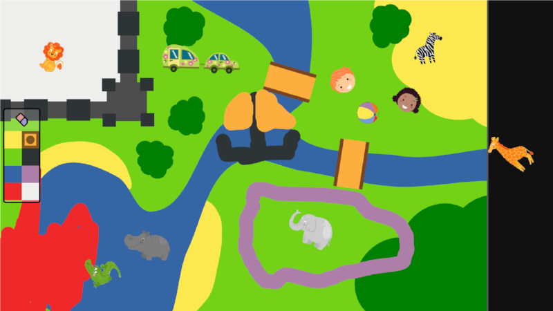

Free-play Sandbox - QtQuick GUI
===============================

*This project is part of the 'Free-play Sandbox' experimental framework for Cognitive Human-Robot
Interaction research. [Check the PInSoRo website](https://freeplay-sandbox.github.io/) for details and [documentation](https://freeplay-sandbox.github.io/freeplay-software)*.




Pre-requisites
--------------

First, you need a working installation of Qt5. On Ubuntu, `sudo apt install
qtdeclarative5-dev qtdeclarative5-qtquick2-plugin`.

You also need [Box2D for QtQuick](https://github.com/qml-box2d/qml-box2d) >=v2.0
for 2D physics. Download it and install it manually.

Second, you need a working installation of
[ROS](http://wiki.ros.org/ROS/Installation) (at time of writing, ROS Kinetic or
ROS Lunar are both ok).

Finally, the sandbox GUI requires my own [ROS plugin for
QtQuick](https://github.com/severin-lemaignan/ros-qml-plugin)

Install it before attempting to compile the sandbox.

Installation
------------

Simply open the Qt project from QtCreator and compile it from there.

**Important: because the freeplay sandbox GUI needs ROS to compile, the ROS
environment needs to be properly configured when starting QtCreator, so that
QtCreator can find the ROS headers & libraries. Assuming your ROS installation
is working, the easiest way to ensure that is simply to manually start QtCreator
from a terminal.**

Usage
-----

Before starting the GUI, you need to launch `roscore` in a different terminal.

When you then launch the application, **the screen is blank**. **This is
normal** as when we run an experiment, we typically do not want anything on the
screen while we welcome the participants.

The [supervisor](https://github.com/freeplay-sandbox/web-supervisor) can be used
to remotely set the current stage of the experiment (and accordingly control the
display).

You can manually trigger the display by opening a terminal and typing:

```
$ rostopic pub /sandtray/signals/start_freeplay std_msgs/Empty
```
